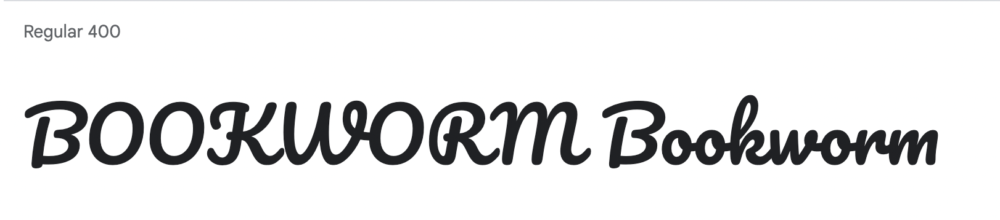
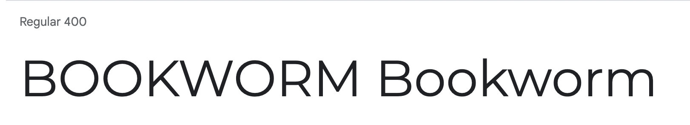

# BookWorm

BookWorm was created as my third milestone project for the Code Institutes Level 5 Diploma in Web Application Development.

Add site responsive screenshot here 

Link to deployed site to go here 

## CONTENTS

* [User Experience](#User-Experience)
  * [Project Goals](#Project-Goals)
  * [User Stories](#User-Stories)

* [Design](#Design)
  * [Colour Scheme](#Colour-Scheme)
  * [Typography](#Typography)
  * [Imagery](#Imagery)
  * [Wireframes](#Wireframes)
  * [Database Structure](#Database-Structure)

* [Features](#Features)
  * [General Features of Each Page](#General-Features-of-Each-Page)
  * [Future Implementations](#Future-Implementations)
  * [Accessibility](#Accessibility)

* [Technologies Used](#Technologies-Used)
  * [Languages Used](#Languages-Used)
  * [Frameworks, Libraries & Programs Used](#Frameworks,-Libraries-&-Programs-Used)
  * [Google Books API](#Google-Books-API)

* [Deployment & Local Development](#Deployment-&-Local-Development)
  * [Deployment](#Deployment)
  * [Local Development](#Local-Development)
    * [How to Fork](#How-to-Fork)
    * [How to Clone](#How-to-Clone)

* [Testing](#Testing)
  
* [Credits](#Credits)
  * [Code Used](#Code-Used)
  * [Content](#Content)
  * [Media](#Media)
  * [Acknowledgments](#Acknowledgments)

- - -

## User Experience

### Project Goals

The idea for Bookworm was created from a need I saw that my mum had. Being a voracious reader, she never knew which books she had sat on her bookshelf at home whilst out purchasing new books. She also finds it difficult to keep track of which book she is currently on in a series, and previous authors she has read who she enjoyed and would like to try more of their work.

I felt that the project could then be taken a step further, and could also provide a way to store reviews on books read together with a rating and the dates read. It would also be nice to make notes about a book, for example, if you have loaned the book out to a friend.

### User Stories

#### Target Audience

The target audience for Bookworm are book lovers all around the world who would like to keep track of their reading and their books.

#### First Time Visitor Goals

As a first time user of the site I want to be able to:

* Understand what the site is for and how to navigate the site.
* Register for an account.
* Search for books.

#### Returning Visitor Goals

As a returning registered user of the site I want to be able to:

* Log in to my account.
* Create, edit, delete and view my bookshelves.
* Create, edit, delete and view my book reviews.

#### Admin User

As an administrator for the site I want to be able to:

* Remove any reviews that are offensive.

- - -

## Design

### Colour Scheme

Image of colour scheme to go here

### Typography

Google Fonts was used to import the chosen fonts for use in the site.

I have used [Pacifico](https://fonts.google.com/specimen/Pacifico#standard-styles) for the headings on the site. I have chosen to use this font as it is a brush script handwriting font which make me think of a fat little bookworm!

I have used [Montserrat](https://fonts.google.com/specimen/Montserrat?query=montserrat&category=Sans+Serif) for the body text on the site. Monserrat is a sans-serif font which allows it to be legible and is a great choice for accessibility.

### Imagery

### Wireframes

Wireframes were created for mobile, tablet and desktop using ...

Wireframes links/images to go here

### Database Structure

- - -

## Features

The website is comprised of …

### Elements found on each page

* Favicon - Created at [Favicon.io](https://favicon.io/). I have chosen an illustration of an open book as it fit the theme of my site, this image has also been used as the logo for the site - which fosters continuity through the site for users and promotes brand awareness.

* Navbar - The Navbar is displayed on all pages of the website and allows users to navigate the site with ease. The navbar is comprised of a logo, the sites name, links to navigate the site and a search bar. The links on the navbar will vary depending on whether a user is logged into their account.

IMAGE OF NAVBAR TO GO HERE

* Footer - A footer is displayed on all pages of the website and contains ***

IMAGE OF FOOTER TO GO HERE

### Future Implementations

### Accessibility

I have been mindful during coding to ensure that the website is as accessible friendly as possible. This has been have achieved by:

* Using semantic HTML.
* Using descriptive alt attributes on images on the site.
* Providing information for screen readers where there are icons used and no text.
* Ensuring that there is a sufficient colour contrast throughout the site.

- - -

## Technologies Used

### Languages Used

HTML, CSS, Javascript, Python

### Frameworks, Libraries & Programs Used

[Flask](https://pypi.org/project/Flask/) - A microframework.

[MongoDB](https://www.mongodb.com/) - Non-relational database used to store the book information.

[PyMongo](https://pypi.org/project/pymongo/) - Python Driver for MongoDB.

[PostgreSQL](https://www.postgresql.org/) - Relational database used to store the users and the bookshelves.

[SQLAlchemy](https://pypi.org/project/SQLAlchemy/) - Database abstraction library, used to interact with PostgreSQL.

[Pip](https://pypi.org/project/pip/) - Tool for installing python packages.

[Jinja](https://jinja.palletsprojects.com/en/3.1.x/) - Templating engine.

[Bootstrap](https://getbootstrap.com/) - version 5.2.0 - CSS Framework.

[Balsamiq](https://balsamiq.com/) - Used to create wireframes.

[Git](https://git-scm.com/) - For version control.

[Github](https://github.com/) - To save and store the files for the website.

[Google Fonts](https://fonts.google.com/) - To import the fonts used on the website.

[Font Awesome](https://fontawesome.com/) - Version ** - For the iconography on the website.

[Google Chrome Dev Tools](https://developer.chrome.com/docs/devtools/) - To troubleshoot and test features, solve issues with responsiveness and styling.

[Tiny PNG](https://tinypng.com/) To compress images for use in the readme.

[Birme](https://www.birme.net/) To resize images and convert to webp format for the site.

[Favicon.io](https://favicon.io/) To create the favicon.

[Am I Responsive?](http://ami.responsivedesign.is/) To show the website image on a range of devices.

[Shields.io](https://shields.io/) To add badges to the README.

### Google Books API

I have used the Google Books API to allow users of the site to search for books. As I was only searching for books I was able to utilise the Google Books API key instead of using OAuth.

I made use of the Google Books API [documentation](https://developers.google.com/books) to learn how to fetch data from the API. The documentation also allowed me to amend my request to only fetch the fields I plan to use on my site. This reduces the amount of data returned to me and will speed up server processing.

- - -

## Deployment & Local Development

### Deployment

The site is deployed using Heroku

Add instructions on how to deploy to heroku here

### Local Development

#### How to Fork

To fork the repository:

1. Log in (or sign up) to Github.
2. Go to the repository for this project, [BookWorm](https://github.com/kera-cudmore/BookWorm).
3. Click the Fork button in the top right corner.

#### How to Clone

To clone the repository:

1. Log in (or sign up) to GitHub.
2. Go to the repository for this project, [BookWorm](https://github.com/kera-cudmore/BookWorm).
3. Click on the code button, select whether you would like to clone with HTTPS, SSH or GitHub CLI and copy the link shown.
4. Open the terminal in your code editor and change the current working directory to the location you want to use for the cloned directory.
5. Type `git clone` into the terminal and then paste the link you copied in step 3. Press enter.
6. Set up a virtual environment.
7. Install the packages from the requirments.txt file by running the following command in the Terminal `pip3 install -r requirements.txt`
8. Set the IP address to 127.0.0.1 and the PORT to 5000.

- - -

## Testing

Please see [testing.md](TESTING.md) for all testing performed
- - -

## Credits

### Code Used

### Content

Content for this project was written by Kera Cudmore.

### Media

* Background image used for the site - [Pile of open books](https://www.rawpixel.com/image/5921249/photo-image-paper-book-public-domain)
* Favicon image - [Hand drawn illustration of open book](https://www.rawpixel.com/image/6475209/png-aesthetic-sticker)

### Acknowledgments

I would like to acknowledge the following people who helped me along the way in completing this project:

* My family, for their patience while I worked on this project.
* My Code Institute Mentor, [Adegbenga Adeye](https://github.com/deye9)
