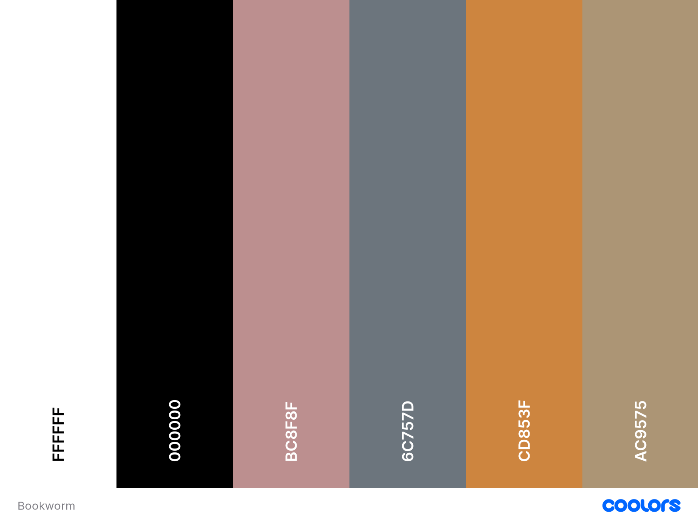

# BookWorm


BookWorm was created as my third milestone project for the Code Institutes Level 5 Diploma in Web Application Development.

Link to deployed site: [Bookworm](https://bookworm2022.herokuapp.com/)


## CONTENTS

* [User Experience](#user-experience)
  * [Project Goals](#project-goals)
  * [User Stories](#user-stories)

* [Design](#design)
  * [Colour Scheme](#colour-scheme)
  * [Typography](#typography)
  * [Imagery](#imagery)
  * [Wireframes](#wireframes)
  * [Database Schema & User Journey](#database-schema--user-journey)
    * [User Jouney](#user-journey)
    * [First Draft Database Schema](#first-draft-database-schema)
    * [Final Database Schema](#final-database-schema)

* [Features](#features)
  * [Elements Fount on Each Page](#elements-found-on-each-page)
  * [Future Implementations](#future-implementations)
  * [Accessibility](#accessibility)

* [Technologies Used](#technologies-used)
  * [Languages Used](#languages-used)
  * [Databases Used](#databases-used)
  * [Frameworks Used](#frameworks-used)
  * [Libraries & Packages Used](#libraries--packages-used)
  * [Programs Used](#programs-used)
    * [Google Books API](#google-books-api)
    * [Flask Blueprints](#flask-blueprints)
    * [Flask Migrate](#flask-migrate)
    * [Error Handling](#error-handling)
    * [Defensive Programming](#defensive-programming)

* [Deployment & Local Development](#deployment--local-development)
  * [Deployment](#deployment)
  * [Local Development](#local-development)
    * [How to Fork](#how-to-fork)
    * [How to Clone](#how-to-clone)

* [Testing](#testing)
  
* [Credits](#credits)
  * [Code Used](#code-used)
  * [Content](#content)
  * [Media](#media)
  * [Acknowledgments](#acknowledgments)

- - -

## User Experience

### Project Goals

The idea for Bookworm was created from a need I saw that my mum had. Being a voracious reader, she never knew which books she had sat on her bookshelf at home whilst out purchasing new books. She also finds it difficult to keep track of which book she is currently on in a series, and previous authors she has read who she enjoyed and would like to try more of their work.

I felt that the project could then be taken a step further, and could also provide a way to store reviews on books read together with a rating and the dates read. It would also be nice to make notes about a book, for example, if you have loaned the book out to a friend.

### User Stories

#### __Target Audience__

The target audience for Bookworm are book lovers all around the world who would like to keep track of their reading and their books.

#### __First Time Visitor Goals__

As a first time user of the site I want to be able to:

* Understand what the site is for and how to navigate the site.
* Register for an account.
* Search for books.

#### __Returning Visitor Goals__

As a returning registered user of the site I want to be able to:

* Log in to my account.
* Create, edit, delete and view my bookshelves.
* Create, edit, delete and view my book reviews.

#### __Admin User__

As an administrator for the site I want to be able to:

* Remove any content that could be offensive. (Future Implementation)

- - -

## Design

### Colour Scheme

I have taken inspiration from the header image for the colour palette and chosen colours that complemenet each other.



### Typography

Google Fonts was used to import the chosen fonts for use in the site.

I have used [Pacifico](https://fonts.google.com/specimen/Pacifico#standard-styles) for the headings on the site. I have chosen to use this font as it is a brush script handwriting font which make me think of a fat little bookworm!


I have used [Montserrat](https://fonts.google.com/specimen/Montserrat?query=montserrat&category=Sans+Serif) for the body text on the site. Monserrat is a sans-serif font which allows it to be legible and is a great choice for accessibility.


### Imagery

As the site is for book lovers, I have kept the imagery throughout the site to the theme of books. Please view the media section for more information on where each image was sourced.

All images of book covers have been requested through the google books API.

### Wireframes

Wireframes were created for mobile, tablet and desktop using Balsamiq.

#### __Home Page__


#### __Register Page__


#### __Login Page__


#### __Profile Page__


#### __Search Page__


#### __Bookshelves Page__


#### __Add Bookshelf Page__


#### __Add/Edit Review Page__


#### __Books Page__


#### __Error Page__


### Database Schema & User Journey

#### __User Journey__


#### __First Draft Database Schema__


#### __Final Database Schema__

The below is the final database schema used for the site. There are some slight changes to some of the column names, and a few fields have been omitted (e.g. the dates read).


The users table and bookshelves table will be created using Postgres. It is a relational database. The primary key for these tables will be their id fields.

The books table will be created using MongoDB. It is a non-relational database.

- - -

## Features

The website is comprised of 12 pages which are extended from a base template.

* Home page
* Login page
* Register page
* Profile page
* Bookshelve page
* Add bookshelf page
* Edit bookshelf page
* Books page
* Add review page
* Edit review page
* Search page
* Error page

### Elements found on each page

* Favicon - Created at [Favicon.io](https://favicon.io/). I have chosen an illustration of an open book as it fit the theme of my site, this image has also been used as the logo for the site - which fosters continuity through the site for users and promotes brand awareness.

  

* Navbar - The Navbar is displayed on all pages of the website and allows users to navigate the site with ease. The navbar is comprised of a logo, the sites name, links to navigate the site and a search bar. The links on the navbar will vary depending on whether a user is logged into their account.

  __User logged in Navbar__
  
  

  __User not logged in Navbar__

  

* Footer - A footer is displayed on all pages of the website and contains the copyright year, this is updated to the current year using [JavaScript](bookworm/static/js/script.js).

  

- - -

### Home Page


### Login Page


### Register Page


### Profile Page


### Bookshelves Page


### Add Bookshelf Page


### Edit Bookshelf Page


### Books Page


### Add Review Page


### Edit Review Page


### Search Page


### Error Page


- - -

### Future Implementations

In future implementations I would like to:

* Add change and reset password functionality to the profile section.
* Give users the option to delete their account in the profile section.
* Allow admin to be able to delete books or bookshelves that contain offensive material.
* Add a barcode scanner to be able to add books via their ISBN number.

### Accessibility

I have been mindful during coding to ensure that the website is as accessible friendly as possible. This has been have achieved by:

* Using semantic HTML.
* Using descriptive alt attributes on images on the site.
* Providing information for screen readers where there are icons used and no text.
* Ensuring that there is a sufficient colour contrast throughout the site.

- - -

## Technologies Used

### Languages Used

HTML, CSS, Javascript, Python

### Databases Used

[MongoDB](https://www.mongodb.com/) - Non-relational database used to store the book information.

[PostgreSQL](https://www.postgresql.org/) - Relational database used to store the users and the bookshelves.

### Frameworks Used

[Flask](https://pypi.org/project/Flask/) - A microframework.

[Bootstrap](https://getbootstrap.com/) - version 5.2.0 - CSS Framework.

### Libraries & Packages Used

[PyMongo](https://pypi.org/project/pymongo/) - Python Driver for MongoDB.

[SQLAlchemy](https://pypi.org/project/SQLAlchemy/) - Database abstraction library, used to interact with PostgreSQL.

[Flask-Migrate](https://flask-migrate.readthedocs.io/en/latest/) - Used to migrate changes to the relational database.

### Programs Used

[Pip](https://pypi.org/project/pip/) - Tool for installing python packages.

[Jinja](https://jinja.palletsprojects.com/en/3.1.x/) - Templating engine.

[Balsamiq](https://balsamiq.com/) - Used to create wireframes.

[Git](https://git-scm.com/) - For version control.

[Github](https://github.com/) - To save and store the files for the website.

[Google Fonts](https://fonts.google.com/) - To import the fonts used on the website.

[Bootstrap Icons](https://icons.getbootstrap.com/) - Version 1.8.3 - For the iconography on the website.

[Google Chrome Dev Tools](https://developer.chrome.com/docs/devtools/) - To troubleshoot and test features, solve issues with responsiveness and styling.

[Tiny PNG](https://tinypng.com/) To compress images for use in the readme.

[Birme](https://www.birme.net/) To resize images and convert to webp format for the site.

[Favicon.io](https://favicon.io/) To create the favicon.

[Am I Responsive?](http://ami.responsivedesign.is/) To show the website image on a range of devices.

[Shields.io](https://shields.io/) To add badges to the README.

[Postman](https://web.postman.co/) To test the API request parameters for Google Books API.

[Lucidchart](https://lucid.app) To create the database schema.

### Google Books API

I have used the Google Books API to allow users of the site to search for books.

I made use of the Google Books API [documentation](https://developers.google.com/books) to learn how to fetch data from the API. The documentation also allowed me to amend my request to only fetch the fields I plan to use on my site. This reduces the amount of data returned to me and will speed up server processing.

As I am only using the API to search for books, and won't be accessing google books shelves or user login data I have chosen to use an API key for access rather than OAuth. My requests to the API contain my API key, the search term the user has created and the fields that I would like to be returned. I have chosen to only receive the books title, authors, description and thumbnail of the book. I have set up the API request to ask for 30 results maximum.

Update - to enable me to get the books unique ID I have had to pull the complete light version when performing a search. This unfortunately means that I am requesting more information than I need, however currently there is no way to pull in the ID with other fields. In future implementations I would look into using graphql as an alternative to calling the api as this will allow me to specify the exact data I would like to have returned.

Please note that there is an issue with the google books API where certain terms don't return a result back. This is something that I will be looking further into to see if there is a way to deal with this. Search terms that return results to show the product working include: dogs, James Patterson, rabbits.

### Flask Blueprints

I wanted to push myself a little with this project and decided that I would like to use Flask Blueprints. Flask Blueprints are a way of logically storing and organising similar routes of the app in their own section, rather than having one large file with all the routes of the app.

### Flask Migrate

Flask-Migrate is an extension that handles SQLAlchemy database migrations for Flask applications using Alembic. The database operations are made available through the Flask command-line interface.I am using Flask Migrate to enable me to migrate changes to my relational database, as I initially forgot to add the created by column to the bookshelves table.

### Error Handling

While researching the best way to handle errors in a Flask application using blueprints I came across the following [article](https://nrodrig1.medium.com/flask-blueprints-error-handling-and-config-file-example-d1a031070763). I really liked how this solution allowed me to create a blueprint to custom handle a number of different errors, rather than just creating a single 404 error page.

### Defensive Programming

I have used defensive programming through my app to ensure that users who are not logged in, or users who did not create the bookshelf or review are unable to edit. This is achieved by checking whether there is a user in session, and then also checking to see if the session user is the same user who created the bookshelf/review. If a user is not the creator, a flash message will be displayed to let them know that they are only able to edit/delete their own bookshelves/reviews and then redirects them to a suitable page. I would like to look into this further and utilise a check that is the session user is "admin" they will be granted access to all bookshelves and reviews to enable them to remove any offensive material.
- - -

## Deployment & Local Development

### Deployment

The site is deployed using Heroku. To deploy to Heroku:

1. To successfully deploy on Heroku we first need to create some files: a requirements.txt file and a Procfile.

2. The requirements.txt file contains all the applications and dependencies that are required to run the app. To create the requirements.txt file run the following command in the terminal:

    ```bash
    pip3 freeze --local > requirements.txt
    ```

3. The Procfile tells Heroku which files run the app and how to run it. To create the Procfile run the following command in the terminal:

    ```bash
    echo web: python app.py > Procfile
    ```

    NOTE: The Procfile uses a capital P and doesn't have a file extension on the end.

4. If the Procfile has been created correctly it will have the Heroku logo next to it. It is also important to check the Procfile contents, as sometimes on creation a blank line will be added at the end of the file. This can sometimes cause problems when deploying to Heroku, so if the file contains a blank line at the end, delete this and save the file. Make sure to save both these files and then add, commit and push them to GitHub.

5. Login (or sign up) to [Heroku.com](https://www.heroku.com).

6. Click the new button and then click create new app.

7. You will then be asked to give your app a name (these must be unique so you cannot reuse bookworm) and select a region. Once these are completed click create app.

8. You will now need to connect the Heroku app to the GitHub repository for the site. Select GitHub in the deployment section, find the correct repository for the project and then click connect.

9. Once the repository is connected, you will need to provide Heroku some config variables it needs to build the app. Click on the settings tab and then click reveal config vars button. You will now need to add the environment key/value variables that were used in the env.py file:

    | KEY | VALUE |
    | :-- | :-- |
    | IP | 0.0.0.0 |
    | PORT | 5000 |
    | SECRET_KEY| YOUR_SECRET_KEY* |
    | MONGO_URI | MONGO_URI* |
    | MONGO_DBNAME | MONGO_DB* |
    | DATABASE_URL | POSTGRES_DB* |
    | GOOGLE_BOOKS_API | GOOGLE_API_KEY* |
    | DEBUG | TRUE** |

    *Denotes a value that is specific to your app.

    **This is set to true to enable us to see any bugs on the live site. ~~Please change to FALSE after deployment.~~ It has been brought to my attention that by leaving the debug variable in my heroku config vars, even if it is saved as false, will actually cause it to be read as true. This is due to the config vars beign saved as strings. Therefore it is better to delete this config var once you are done with debugging.

10. You're now ready to click the enable automatic deploys and create button. Heroku will start building the app.

11. As this project utilises a relational database, there are a few more steps to set this up.

12. On the heroku dashboard go to resources tab and then select add-ons. You will need to search for and select heroku postgres. For this project the hobby dev free tier is fine.

13. Go back into settings and reveal config vars. You should now see a new key called DATABASE_UL and the value should have been pre-populated.

14. We will now need to go the more button on the dashboard and select run console. This is where we will set up the tables in the database we have just created.

15. Type python3 and then once the python interpretor opens, we can run the following:

    ```bash
    from bookworm import db
    db.create_all()
    exit()
    ```

16. Now that the relational database has been set up and the tables created, we can now click open app and the bookworm application should now open in a new tab.

### Local Development

#### How to Fork

To fork the repository:

1. Log in (or sign up) to Github.

2. Go to the repository for this project, [BookWorm](https://github.com/kera-cudmore/BookWorm).

3. Click the Fork button in the top right corner.

#### How to Clone

To clone the repository:

1. Log in (or sign up) to GitHub.

2. Go to the repository for this project, [BookWorm](https://github.com/kera-cudmore/BookWorm).

3. Click on the code button, select whether you would like to clone with HTTPS, SSH or GitHub CLI and copy the link shown.

4. Open the terminal in your code editor and change the current working directory to the location you want to use for the cloned directory.

5. Type the following command in the terminal (after the git clone you will need to paste the link you copied in step 3 above):

    ```bash
    git clone { & THE LINK FROM STEP 3 }
    ```

6. Set up a virtual environment (this step is not required if you are using the Code Institute Template in GitPod as this will already be set up for you).

7. Install the packages from the requirements.txt file by running the following command in the Terminal:

    ```bash
    pip3 install -r requirements.txt
    ```

- - -

## Testing

Please see [testing.md](TESTING.md) for all testing performed
- - -

## Credits

### Code Used

* [Star Rating Code.](https://bbbootstrap.com/snippets/bootstrap-rate-your-experience-template-star-ratings-30972576) The following code was used and adapted for the star rating system in the book reviews.
* [glassmorphism-generator](https://hype4.academy/tools/glassmorphism-generator). Used to create the coloured card panels.
* [Error Handling](https://nrodrig1.medium.com/flask-blueprints-error-handling-and-config-file-example-d1a031070763) I used the following code mentioned in this article as a basis for creating my custom error handling.

### Content

Content for this project was written by Kera Cudmore, and the book descriptions were provided through the Google Books API.

### Media

* Favicon image - [Hand drawn illustration of open book](https://www.rawpixel.com/image/6475209/png-aesthetic-sticker)
* Background image used for the site header - [Pile of open books](https://www.rawpixel.com/image/5921249/photo-image-paper-book-public-domain)
* Index page image - [Book with heart pages](https://unsplash.com/photos/f6UX-It1N7g)
* Error page image - [Shelved Books](https://www.pexels.com/photo/books-768125/)

### Acknowledgments

I would like to acknowledge the following people who helped me along the way in completing this project:

* My family, for their patience while I worked on this project.
* My Code Institute Mentor, [Adegbenga Adeye](https://github.com/deye9)
* Daisy McGirr, for taking the time to respond to my slack post about creating a unique ID in my for loop, and helping me troubleshoot why my defensive programming wasn't working.
* Naiose Gaffney, for talking through and troubleshooting with me ways to pull data from the search to the add review page.
* The fantastic Tutor Support team at Code Institute.
