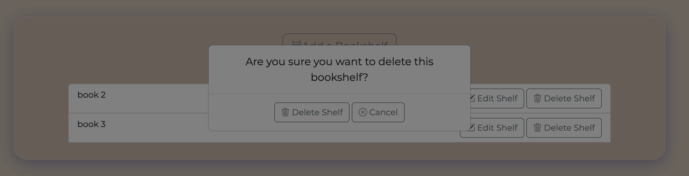

# BookWorm -  Testing

Site image here 

Visit the deployed site: site link here

- - -

## CONTENTS

* [AUTOMATED TESTING](#AUTOMATED-TESTING)
  * [W3C Validator](#W3C-Validator)
  * [JavaScript Validator](#JavaScript-Validator)
  * [Python Validator](#Python-Validator)
  * [Lighthouse](#Lighthouse)
  * [WAVE Testing](#WAVE-Testing)
* [MANUAL TESTING](#MANUAL-TESTING)
  * [Testing User Stories](#Testing-User-Stories)
  * [Full Testing](#Full-Testing)
* [BUGS](#BUGS)
  * [Solved Bugs](#Solved-Bugs)
  * [Known Bugs](#Known-Bugs)

Testing was ongoing throughout the entire build. I utilised Chrome developer tools whilst building to pinpoint and troubleshoot any issues as I went along.

During development I made use of Google Chrome Developer Tools to ensure everything was working correctly and to assist with troubleshooting when things were not working as expected.

I have gone through each page using Google Chrome Developer Tools & Firefox i
Inspector Tools to ensure that each page is responsive on a variety of different screen sizes and devices.

- - -

## AUTOMATED TESTING

### W3C Validator

[W3C](https://validator.w3.org/) was used to validate the HTML on all pages of the website. It was also used to validate the CSS.

* Index Page -
* Add Bookshelf Page -
* Add Review Page -
* Books Page - 
* Bookshelves Page -
* Edit Bookshelf Page - 
* Edit Review Page -
* Error Page - 
* Login Page - 
* Profile Page - 
* Register Page -
* Search Page -

- - -

### JavaScript Validator

[jshint](https://jshint.com/) was used to validate the JavaScript.

* script.js

- - -

### Python Validator

[PEP8]()was used to validate the python files.

* app.py

- - -

### Lighthouse

I used Lighthouse within the Chrome Developer Tools to test the performance, accessibility, best practices and SEO of the website.

### Desktop Results

* Index Page -
* Add Bookshelf Page -
* Add Review Page -
* Books Page - 
* Bookshelves Page -
* Edit Bookshelf Page - 
* Edit Review Page -
* Error Page - 
* Login Page - 
* Profile Page - 
* Register Page -
* Search Page -

### Mobile Results

* Index Page -
* Add Bookshelf Page -
* Add Review Page -
* Books Page - 
* Bookshelves Page -
* Edit Bookshelf Page - 
* Edit Review Page -
* Error Page - 
* Login Page - 
* Profile Page - 
* Register Page -
* Search Page -

- - -

### WAVE Testing

[WAVE](http://wave.webaim.org/) (Web Accessibility Evaluation Tool) allows developers to create content that is more accessible to users with disabilities. It does this by identifying accessibility and WGAC errors.

* Index Page -
* Add Bookshelf Page -
* Add Review Page -
* Books Page - 
* Bookshelves Page -
* Edit Bookshelf Page - 
* Edit Review Page -
* Error Page - 
* Login Page - 
* Profile Page - 
* Register Page -
* Search Page -

- - -

## MANUAL TESTING

### Testing User Stories

| Goals | How are they achieved? | Image |
| :--- | :--- | :--- |
| `First Time Visitors` |
| :--- | :--- | :--- |
| Understand what the site is for and how to navigate the site. | A description of what the site is is included on the home page. | :--- |
| Register for an account. | The description on the home page encourages new users to register for an account. A register link is displayed on the navbar if a user is not logged in. | :--- |
| Search for books | Users are always shown the search link on the navbar regardless of their login status. | :--- |
|`Returning Visitors`|
| :--- | :--- | :--- |
| Log in to my account | If a user is not logged into an account, a login link is provided on the navbar. | :--- |
| Create a bookshelf | -- | :--- |
| Edit a bookshelf | :--- | :--- |
| Delete a bookshelf | :--- | :--- |
| Create a book review | :--- | :--- |
| Edit a book review | :--- | :--- |
| Delete a book review | :--- | :--- |
|`Admin User` |
| :--- | :--- | :--- |
| Remove any reviews that are offensive | :--- | :--- |

- - -

### Full Testing

Full testing was performed on the following devices:

* Laptop:
  * Macbook Pro 2021 14 inch screen
* Mobile Devices:
  * iPhone 13 pro.
  * iPhone 11 pro.
  * Phone X.

Each device tested the site using the following browsers:

* Google Chrome
* Safari
* Firefox

Additional testing was taken by friends and family on a variety of devices and screen sizes.

| Feature | Expected Outcome | Testing Performed | Result | Pass/Fail |
| --- | --- | --- | --- | --- |
| `Navbar` |
| --- | --- | --- | --- | --- |
| `Footer` |
| --- | --- | --- | --- | --- |

 - - -

## BUGS

### Solved Bugs

| No | Bug | How I solved the issue |
| :--- | :--- | :--- |
| 1 | When I added the accordion to the book search results, the accordion would open and close on all books together when triggered due to the accordion being created in the for loop, the id was identical for all results. | To enable each accordion to open and close indivually I needed to find a way to create a unique ID on every iteration of the for loop. Initally I considered taking the title and using the python method replace to remove any spaces in the title. However this would have been a problem if there were two books with identical names. I posed my question on slack and Daisy suggested using a loop.counter. On researching this I discovered it is only applicable to Django, however something very similar exists in Jinja - a loop.index. By using the loop.index in the id attribute I was able to create a unique ID for each book and this allowed the accordion to be opened and closed on each book individually.  |
| 2 | The bootstrap modal for deleting a bookshelf was displaying but was hidden under the backdrop, making it impossible to use the modal buttons or to exit out of the modal.  | I initially tried moving the modal code within the file but this made no difference. Upon searching google for bootstrap modal greyed out I found the following [article](https://weblog.west-wind.com/posts/2016/Sep/14/Bootstrap-Modal-Dialog-showing-under-Modal-Background?utm_source=feedburner&utm_medium=feed&utm_campaign=Feed%3A+RickStrahl+%28Rick+Strahl%27s+WebLog%29). I tried a few of the fixes, which didn't work before finding that the fix to remove the backdrop did work. This is not an ideal fix, but works for the moment until I can research this issue further and find a more elegant solution. |

- - -

### Known Bugs
