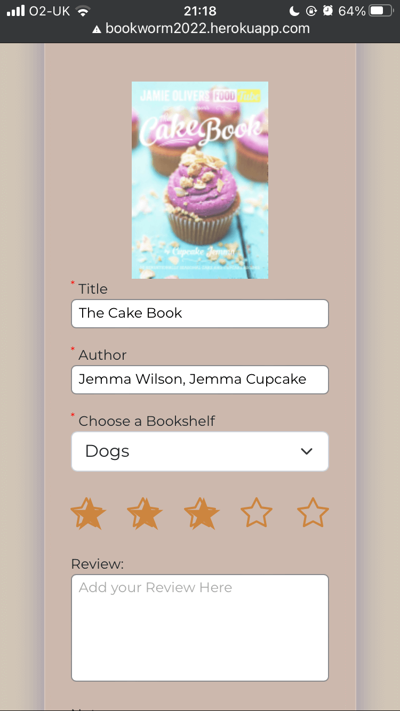
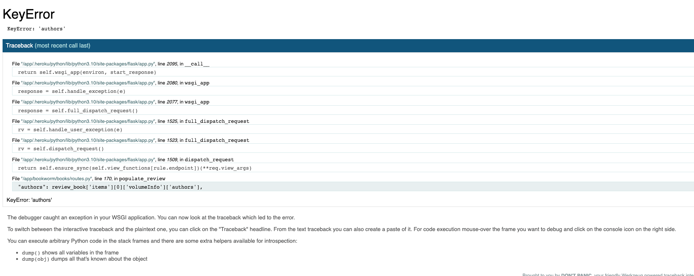
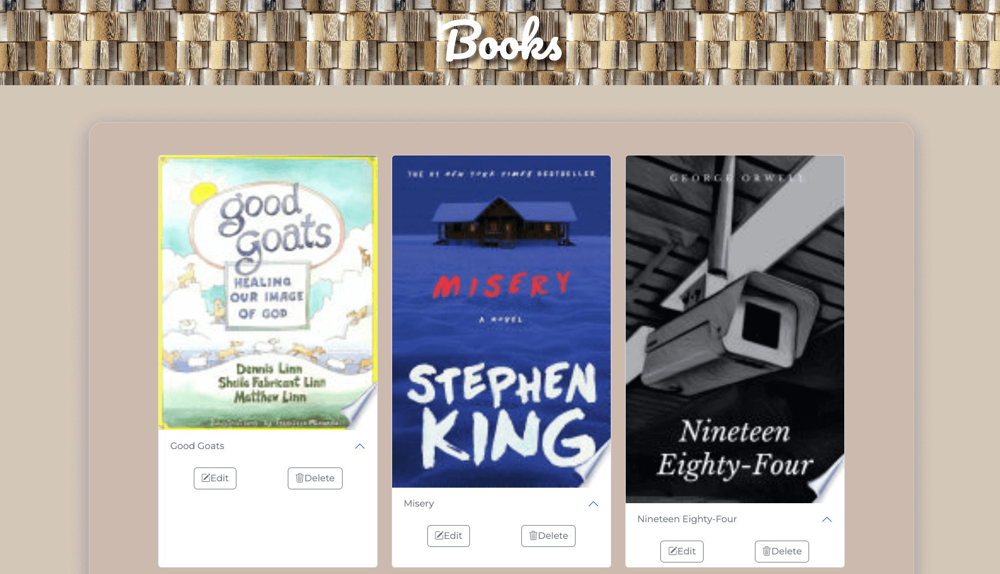

# BookWorm -  Testing


Visit the deployed site: [Bookworm](https://bookworm2022.herokuapp.com/)

- - -

## CONTENTS

* [AUTOMATED TESTING](#automated-testing)
  * [W3C Validator](#w3c-validator)
  * [JavaScript Validator](#javascript-validator)
  * [Python Validator](#python-validator)
  * [Lighthouse](#lighthouse)
  * [WAVE Testing](#wave-testing)
* [MANUAL TESTING](#manual-testing)
  * [Testing User Stories](#testing-user-stories)
  * [Full Testing](#full-testing)
* [BUGS](#bugs)
  * [Solved Bugs](#solved-bugs)
  * [Known Bugs](#known-bugs)

Testing was ongoing throughout the entire build. During development I made use of Google Chrome Developer Tools to ensure everything was working correctly and to assist with troubleshooting when things were not working as expected.

I have gone through each page using Google Chrome Developer Tools to ensure that each page is responsive on a variety of different screen sizes and devices.

- - -

## AUTOMATED TESTING

### W3C Validator

[W3C](https://validator.w3.org/) was used to validate the HTML on all pages of the website. It was also used to validate the CSS. I have checked the HTML via direct input and also by inspecting the page source and running this through the validator.

* [Index Page](https://validator.w3.org/nu/?doc=https%3A%2F%2Fbookworm2022.herokuapp.com%2F) - No errors or warnings.
* [Register Page](https://validator.w3.org/nu/?doc=https%3A%2F%2Fbookworm2022.herokuapp.com%2Fregister) - No errors or warnings.
* [Login Page](https://validator.w3.org/nu/?doc=https%3A%2F%2Fbookworm2022.herokuapp.com%2Flogin) - No errors or warnings.
* [Profile Page](https://validator.w3.org/nu/?doc=https%3A%2F%2Fbookworm2022.herokuapp.com%2Fprofile%3Fusername%3Dadmin) - No errors or warnings.
* [Bookshelves Page](https://validator.w3.org/nu/?doc=https%3A%2F%2Fbookworm2022.herokuapp.com%2Fbookshelves) - No errors or warnings.
* [Add Bookshelf Page](https://validator.w3.org/nu/?doc=https%3A%2F%2Fbookworm2022.herokuapp.com%2Fadd_bookshelf) - No errors or warnings.
* [Edit Bookshelf Page](https://validator.w3.org/nu/?doc=https%3A%2F%2Fbookworm2022.herokuapp.com%2Fedit_bookshelf%2F23) - No errors or warnings.
* [Search Page](https://validator.w3.org/nu/?doc=https%3A%2F%2Fbookworm2022.herokuapp.com%2Fsearch) - No errors or warnings.
* [Add Review Page](https://validator.w3.org/nu/?doc=https%3A%2F%2Fbookworm2022.herokuapp.com%2Fpopulate_review%3Fgbook_id%3D7OdQvuI-eygC) - No errors or warnings.
* [Books Page](https://validator.w3.org/nu/?doc=https%3A%2F%2Fbookworm2022.herokuapp.com%2Fview_books) - No errors or warnings.
* [Edit Review Page](https://validator.w3.org/nu/?showsource=yes&doc=https%3A%2F%2Fbookworm2022.herokuapp.com%2Fedit_review%2F62e458bbbd1b8de864934262) - No errors or warnings.
* [Error Page](https://validator.w3.org/nu/?doc=https%3A%2F%2Fbookworm2022.herokuapp.com%2Fedit_bookshelf%2Ferror) - No errors or warnings.

~~The validator has returned warnings for the use of aria-labels on all pages using the bootstrap icons. I am happy to leave these warnings as I have followed the instructions on the bootstrap site regarding the use of aria labels with icons, and the use of the aria labels is important for accessibility.~~

UPDATE Nov 2022 - aria-label warning: I have since been advised that the best way to deal with the issue of the aria-labels throwing a warning in the validator is to move the aria-label to the parent DOM element. I have now updated this for all aria-labels that were included in an `<i>` tag, and the warning no longer appears when validating.

- - -

### JavaScript Validator

[jshint](https://jshint.com/) was used to validate the JavaScript.

* [script.js](documentation/testing/validation/jshint-script.png)

- - -

### Python Validator

~~[PEP8](http://pep8online.com/) was used to validate the python files. Due to limited time for completing this project I have been unable to completely fix all PEP8 errors in all the files, I need to do some further research into the best ways to break lines that are too long.~~

UPDATE Nov 2022: The PEP8 validator site mentioned above has since gone down. I am therefore relying on using the [pycodestyle](https://pypi.org/project/pycodestyle/) package within my IDE to ensure that my code meets PEP8 guidelines.

* [app.py](documentation/testing/validation/python-app.png) - No errors or warnings.
* [models.py](documentation/testing/validation/python-models.png) - No errors or warnings.
* [__init__.py](documentation/testing/validation/python-init.png) - No errors or warnings.
* [auth/routes.py](documentation/testing/validation/python-auth-routes.png) - Please see further information below regarding nomember error resolution. No other errors or warnings.
* [books/routes.py](documentation/testing/validation/python-book-routes.png) - Please see further information below regarding nomember error resolution, and bare exception resolution. No other errors or warnings.
* [error_handlers/routes.py](documentation/testing/validation/python-error-routes.png) - There is a [warning](documentation/testing/validation/error-route-pep8.png) regarding the argument `e` not being used. I tried removing this argument from the code, however the error pages then didn't load, they defaulted to the generic error pages. I have added back in the argument `e` to allow the error handling to work correctly and to display my own error pages to the user. I am therefore happy to leave this warning in place. Pylint also gives feedback that the argument `e` doesn't conform to snake_case naming style. Again I am happy to leave this feedback, as there is no way to snake_case name a singular letter.
* [main/routes.py](documentation/testing/validation/python-main-routes.png) - No errors or warnings.

Nomember error resolution.

The auth and book routes.py files were both showing an error:

``` bash
Instance of 'scoped_session' has no 'add' memberpylint(no-member)
```

Upon doing some research regarding this error I came across the following [solution](https://cs50.stackexchange.com/questions/32768/instance-of-scoped-session-has-no-commit-member), which also referenced this answer on [stackoverflow](https://stackoverflow.com/questions/42789666/pylint-error-message-on-cloud-9-cs50). It seems to be an issue with the way the pylinter reads the python file. Research suggested that I add the following code to a `.pylintrc` file to let the linter know to ignore this error: `ignored-classes=SQLObject,Registrant,scoped_session`.

Bare exception resolution.

In the books/route.py file I was getting an error relating E722 no bare exceptions. I did some further research on this error and added Exeption after the except to solve this issue as mentioned in this [stackoverflow question](https://stackoverflow.com/questions/54948548/what-is-wrong-with-using-a-bare-except).

I have also been able to run all my python files through the [Code Insitute Python Linter](https://pep8ci.herokuapp.com/) which they released to students on the 15th of November. It shows no errors in any of my python files.
- - -

### Lighthouse

I used Lighthouse within the Chrome Developer Tools to test the performance, accessibility, best practices and SEO of the website. These scores are somewhat lower than what I would like them to be so this is something that I would prioritise improving in the next implementation.

### Desktop Results

* [Index Page](documentation/testing/validation/lh-index-desk.png)
* [Add Bookshelf Page](documentation/testing/validation/lh-add-bookshelf-desk.png)
* [Add Review Page](documentation/testing/validation/lh-add-review-desk.png)
* [Books Page](documentation/testing/validation/lh-books-desk.png)
* [Bookshelves Page](documentation/testing/validation/lh-bookshelves-desk.png)
* [Edit Bookshelf Page](documentation/testing/validation/lh-edit-bookshelf-desk.png)
* [Edit Review Page](documentation/testing/validation/lh-edit-review-desk.png)
* [Error Page](documentation/testing/validation/lh-error-desk.png)
* [Login Page](documentation/testing/validation/lh-login-desk.png)
* [Profile Page](documentation/testing/validation/lh-profile-desk.png)
* [Register Page](documentation/testing/validation/lh-register-desk.png)
* [Search Page](documentation/testing/validation/lh-search-desk.png)

- - -

### WAVE Testing

[WAVE](http://wave.webaim.org/) (Web Accessibility Evaluation Tool) allows developers to create content that is more accessible to users with disabilities. It does this by identifying accessibility and WGAC errors.

I have used the WAVE testing tool to try and ensure there are no accessibility issues with my site.

- - -

## MANUAL TESTING

### Testing User Stories

| Goals | How are they achieved? | Image |
| :--- | :--- | :--- |
| `First Time Visitors` |
|  |  |  |
| Understand what the site is for and how to navigate the site. | A description of what the site is is included on the home page. | :--- |
| Register for an account. | The description on the home page encourages new users to register for an account. A register link is displayed on the navbar if a user is not logged in. | :--- |
| Search for books | Users are always shown the search link on the navbar regardless of their login status. | :--- |
|`Returning Visitors`|
|  |  |  |
| Log in to my account | If a user is not logged into an account, a login link is provided on the navbar. | :--- |
| Create a bookshelf | The create a bookshelf button is displayed prominently at the top of the bookshelves page. | :--- |
| Edit a bookshelf | When a user views their bookshelves on the bookshelves page, they are given the option to edit their bookshelf. | :--- |
| Delete a bookshelf | When a user views their bookshelves on the bookshelves page, they are given the option to delete their bookshelf. When the user selects delete, a modal will pop up to confirm deletion and to let the user know that all books shelved on that bookshelf will also be deleted. | :--- |
| Create a book review | When a user searches for a book, they are shown the results of the search and each result has a shelve this book button. When the user clicks on this they are redirected to the review page. | :--- |
| Edit a book review | When a user views their books, each book has an edit button, which will take the user to the edit review page with the books information pre-populated. | :--- |
| Delete a book review | When a user views their books, each book has a delete button, when the user clicks this a modal will pop up to confirm the user wishes to delete the book. | :--- |
|`Admin User` |
|  |  |  |
| Remove any reviews that are offensive | Due to time constraints, I have had to place this item in the future implementations list. |  |

- - -

### Full Testing

Full testing was performed on the following devices:

* Laptop:
  * Macbook Pro 2021 14 inch screen
* Mobile Devices:
  * iPhone 13 pro.
  * iPhone 11 pro.
  * Phone X.

Each device tested the site using the following browsers:

* Google Chrome
* Safari
* Firefox

Additional testing was taken by friends and family on a variety of devices and screen sizes. A Big thank you to [Megan](https://github.com/Medusas71) for taking the time to thoroughly test the site for me.

| Feature | Expected Outcome | Testing Performed | Result | Pass/Fail |
| --- | --- | --- | --- | --- |
| `Navbar` |
|  |  |  |  |  |
| Bookworm Logo & Title | When clicked the user will be redirected to the home page. | Clicked Logo and title | Redirected to the home page. | Pass |
| Home Page Link | When clicked the user will be redirected to the home page.| Clicked link | Redirected to the home page. | Pass |
| Search Link | When clicked the user will be redirected to the search page. | Clicked link | Redirected to the search page. | Pass |
| Bookshelves Link (Logged in users only) | When clicked the user will be redirected to the bookshelves page. | Clicked link | Redirected to the bookshelves page | Pass |
| Books Link (Logged in users only) | When clicked the user will be redirected to the books page. | Clicked link | Redirected to the books page | Pass |
| Profile Link (Logged in users only) | When clicked the user will be redirected to the profile page. | Clicked link | Redirected to the profile page | Pass |
| Log in Link (Only shown if user not in session) | When clicked the user will be redirected to the log in page. | Clicked link | Redirected to the log in page | Pass |
| Register Link (Only shown if user not in session) | When clicked the user will be redirected to the register page. | Clicked link | Redirected to the register page  | Pass |
| Log out Link (Logged in users only) | When clicked the user will be redirected to the home page and a flash message displayed to let the user know they have been logged out successfully. | Clicked link |Redirected to the home page and a flash message displayed to let me know I have been logged out | Pass |
| `Footer` |
|  |  |  |  |  |
| Bookworm Title | When clicked the user will be redirected to the home page. | Clicked Logo and title | Redirected to the home page. | Pass |
| Copyright year | The copyright should display the correct year - this is a javascript function that checks what the current year is and injects it into the footer | Checked the year | Displaying the correct year | Pass |
| `Home Page` |
|   |   |   |   |
| Register link in the blurb | When clicked the user will be redirected to the register page. | Clicked link  | Redirected to the register page | Pass |
| Search link in the blurb | When clicked the user will be redirected to the search page. | Clicked link | Redirected to search page | Pass |
| `Log in Page` |
| Username input - empty | This is a required field so the form should not submit if empty | Tried to submit the form with this field empty | Tooltip tells me this field is required | Pass |
| Password input empty | This is a required field so the form should not submit if empty | Tried to submit the form with this field empty | tooltip tells me this field is required |  Pass |
| log in button | Saves the user to session and redirects to the profile page. Flash message shown welcoming the user | Submitted form | Redirected to the profile page and flash message shown | Pass |
| Incorrect username or password used | A flash message should display saying username/password incorrect - this is defensive programming - not letting user know which input is incorrect | Incorrect username/password entered | Message flashes to let the user know they have entered an incorrect username/password | Pass |
| Link to register page |  This should redirect the user to the register page | Clicked link | Redirected to the register page | Pass |
| `Register Page` |
| | | | | | |
| Username input | The username should be 5 characters minimum | Entered username less than 5 characters long | tooltip lets the user know they have not entered enough characters | Pass |
| Username input - empty | The username is a required field, so should not submit with no value | Tried to submit form with no value entered | Tooltip lets user know this value is required | Pass |
| Username input | If username is in use, message should flash to user | entered an in use username | Message flashed to say username already in use | Pass|
| Email input | The email input should include an email address  | Entered plain text | Tooltip tells user to use an email address here | Pass |
| Email input - empty | The email is a required field, so should not submit with no value | Tried to submit form with no value entered | Tooltip lets user know this value is required | Pass |
| Password input | This field should be at least 5 characters long | Entered password less than 5 characters long | Tooltip tells user the password should be at least 5 characters long | Pass |
| Password input - empty | The password is a required field, so should not submit with no value | Tried to submit form with no value entered | Tooltip lets user know this value is required | Pass |
| Register button | Should redirect user to the log in page and a registration successful message flashed | Created new user and submitted form | Redirected to the log in page and message flashed | Pass |
| `Search Page` |
|   |   |   |   |  |
| Search feature | A search is performed when the user enters a search term | Searched for rabbits | The search returns book results | Pass |
| Search feature. - Error | If there is an error with the search, a flash message is displayed to let the user know there was a problem and directs them to try again. | Searched for bulldogs | The search doesn't return a result (please see known bugs No 2), and a flash message is displayed to the user | Pass |
| Shelve this book button on search result book (user signed in) | When the user clicks the shelve this book button they should be redirected to the add review page | Clicked button while signed in | Redirected to the add review page and book information pre-populated | Pass |
| Shelve this book button on search result book (user not signed in) | When the user clicks the shelve this book button they should be flashed a message to let them know they need to be logged in to shelve a book and be redirected to the log in page | Clicked button while not signed in | Redirected to the log in page and flash message displayed | Pass |
| `Bookshelves Page` |
|   |   |   |   |  |
| Add a bookshelf button | When the user clicks this button they should be taken to the add a bookshelf page | Clicked button | Redirected to the add a bookshelf page | Pass |
| Bookshelf accordion | When the user selects a bookshelf, the accordion opens to display the edit and delete bookshelf buttons | Clicked shelf | Accordion opened to display edit and delete buttons | Pass |
| Edit bookshelf button on bookshelf accordion | The user should be taken to the edit bookshelf page with the selected bookshelf pre-populated in the input | Clicked button | Taken to the edit bookshelf page. Input pre-populated with the current bookshelf name | Pass |
| Delete button on bookshelf accordion | When the user clicks the delete button a modal should pop up asking the user to confirm they wish to delete the bookshelf and that by deleting the bookshelf all books associated with the shelf will be deleted too | Clicked button | Modal popped up and displayed the confirm deletion message | Pass |
| Delete Button on Deletion modal| When the user clicks the delete button the bookshelf should be deleted along with any books that were associated with the shelf. A flash message will confirm deletion and the user is redirected to the bookshelves page | Clicked button | Bookshelf deleted together with associated books and a flash message displayed success. Redirected to the bookshelves page | Pass |
| Cancel button on deletion modal | When the user clicks the cancel button the modal should close | Clicked button | Modal closed | Pass |
| `Books Page` |
|   |   |   |   |  |
| Accordion button | Open/close the accordion | Click button | Accordion opens and closes | Pass |
| Edit button on book | When the edit button is clicked the user should be taken to the edit review page with the inputs pre-populated with the values stored in the database for that book | Clicked button | Redirected to the edit review page. Books details filled in with previously saved information | Pass |
| Delete button on book | When the user clicks this button a modal should pop up asking the user to confirm they wish to delete this book | Clicked button | Modal popped up to confirm if I wanted to delete the book | Pass |
| Delete button on modal | When clicked the book should be deleted | Clicked button | Book Deleted from books page | Pass |
| Cancel button on modal | When clicked the modal should close | Clicked button | Modal closed | Pass |
| `Add Bookshelf Page` |
| Bookshelf input | Should prompt the user to enter a shelf name if left blank | Left blank and clicked add bookshelf button | Tooltip tells you this field needs to be filled in | Pass |
| Add Bookshelf button | Saves the new bookshelf to the database, redirects the user to the bookshelves page and flashes message to let the user know successful | Clicked button | Bookshelf saved to the database, redirected to the bookshelves page and flash message to save bookshelf created successfully | Pass |
| `Edit Bookshelf Page` |
| Input | This should be pre-populated with the bookshelf selected | Checked input against the bookshelf selected |Input pre-populated with the bookshelf selected | Pass |
| Input - no value entered | The form requires this field be filled in before submission | Left input blank | Tooltip lets me know this field is required | Pass |
| Edit bookshelf button | When clicked the updated shelf name should be saved to the database, the user redirected to the bookshelves page and a message flashed to let them know updated successfully | clicked button | Updated bookshelf name added to the database, redirected to bookshelf page and flash message shows update has been successful | Pass |
| `Add Review Page` |
|   |   |   |   |   |
| Title input | This is a required field so should ask for a value to be entered if empty. This field should be pre-populated with the book information selected in the search | Input was pre-populated. Cleared the input | Tooltip told me it is a required field | Pass |
| Author input | This is a required field so should ask for a value to be entered if empty. This field should be pre-populated with the book information selected in the search | Input was pre-populated. Cleared the input | Tooltip told me it is a required field | Pass |
| Bookshelf dropdown | This should be populated with all the bookshelves associated with the user | Checked to see if all my created bookshelves were displayed | Only my bookshelves are displayed | Pass |
| Star Ratings | These should be able to be selected to choose your rating | clicked random ratings | The rating was saved to the database | Pass |
| Review Field | This is an optional field. Any information entered should be saved to the database | Text entered | Text saved to the database | Pass |
| Notes Field | This is an optional field. Any information entered should be saved to the database | Text entered | Text saved to the database | Pass |
| Add Review Button | This should add the review to the database and redirect the user to the books page and flash a message to let the user know the book was saved successfully | Clicked button | Review saved to database and redirected to books page, message flashed to let me know book saved successfully | Pass |
| `Edit Review Page` |
| Title input | This is a required field so should ask for a value to be entered if empty. This field should be pre-populated with the book information saved to the database | Input was pre-populated. Cleared the input | Tooltip told me it is a required field | Pass |
| Author input | This is a required field so should ask for a value to be entered if empty. This field should be pre-populated with the book information saved to the database | Input was pre-populated. Cleared the input | Tooltip told me it is a required field | Pass |
| Bookshelf dropdown | This should be populated with all the bookshelves associated with the user | Checked to see if all my created bookshelves were displayed | Only my bookshelves are displayed | Pass |
| Star Ratings | These should be able to be selected to choose your rating. Rating saved to the database should be displayed | Rating saved to the database displayed. Clicked random rating to change the rating | The rating was saved to the database | Pass |
| Review Field | This is an optional field. Previously saved review should display here. Any information entered should be saved to the database | Saved review text displayed. Text Changed | Text saved to the database | Pass |
| Notes Field | This is an optional field. Previous saved notes should display here. Any information entered should be saved to the database | Notes previously saved to the database displayed, text changed | Text saved to the database | Pass |
| Edit Review Button | This should add the updated review to the database and redirect the user to the books page and flash a message to let the user know the book was saved successfully | Clicked button | Review saved to database and redirected to books page, message flashed to let me know book saved successfully | Pass |
| `Error Page` |
|   |   |   |   |   |
| Home page link | Redirects the user to the home page | Clicked link | Redirected to home page | Pass |

 - - -

## BUGS

### Solved Bugs

| No | Bug | How I solved the issue |
| :--- | :--- | :--- |
| 1 | When I added the accordion to the book search results, the accordion would open and close on all books together when triggered due to the accordion being created in the for loop, the id was identical for all results. | To enable each accordion to open and close individually I needed to find a way to create a unique ID on every iteration of the for loop. Initially I considered taking the title and using the python method replace to remove any spaces in the title. However this would have been a problem if there were two books with identical names. I posed my question on slack and Daisy suggested using a loop.counter. On researching this I discovered it is only applicable to Django, however something very similar exists in Jinja - a loop.index. By using the loop.index in the id attribute I was able to create a unique ID for each book and this allowed the accordion to be opened and closed on each book individually.  |
| 2 | The bootstrap modal for deleting a bookshelf was displaying but was hidden under the backdrop, making it impossible to use the modal buttons or to exit out of the modal.  | I initially tried moving the modal code within the file but this made no difference. Upon searching google for bootstrap modal greyed out I found the following [article](https://weblog.west-wind.com/posts/2016/Sep/14/Bootstrap-Modal-Dialog-showing-under-Modal-Background?utm_source=feedburner&utm_medium=feed&utm_campaign=Feed%3A+RickStrahl+%28Rick+Strahl%27s+WebLog%29). I tried a few of the fixes, which didn't work before finding that the fix to remove the backdrop did work. This is not an ideal fix, but works for the moment until I can research this issue further and find a more elegant solution. |
| 3 | Users could try to view the bookshelves page by entering the URL for the bookshelves page whilst not logged in and would be presented with a keyerror page. This was not a great user experience as it did not display any information that would be useful to a user as to what the issue was. | Upon checking my routes for the bookshelves page, I found that I had not included any defensive programming to prevent a user from trying to view the bookshelves page without being logged in. I have Added the logic to check whether a user is in session, and if not to present a flash message. This provides the user with a better overall experience on the site and provides them with some useful feedback - letting the user know they need to be logged in to view their bookshelves and then redirecting them to the log in page. |
| 4 | Users could try to view the books page by entering the URL for the books page whilst not logged in and would be presented with a keyerror page. This was not a great user experience as it did not display any information that would be useful to the user as to what the issue was. | Upon checking my view_books route, I found that I had not included any defensive programming that would prevent a user from accessing the page without being logged in. I have added the logic to check whether the user is in session, and if not to present a flash message. This provides the user with a better overall experience on the site and provides them with some useful feedback - letting the user know they need to be logged in to view the books page and redirecting them to the log in page. |
| 5 | No user feedback when user enters a bookshelf name already in use | I had originally created this columns in the database to be a unique field. As I thought that a user wouldn't want to have two bookshelves with the same name. This then raised the issue that the bookshelf name could only be used once by anyone - so two users couldn't create a to be read shelf. This was not a great user experience, and I could either change it so that the column wouldn't be unique, or I could just handle the error by flashing an error message to the user telling them this bookshelf name was already taken. I decided that it would be a better user experience to allow all users to be able to make a shelf with the same name. I made the changes to my models.py and migrated these changes using flask migrate. I then pushed these changes to GitHub and ran the migrations in the heroku console. Unfortunately, the migrations were not being deployed to the live site, despite them working on the local version of the site. I performed a lot of research on slack and google, spoke to peers about the problem, referred back to the lesson material and eventually contacted tutor support regarding the issue. Tutor support recommended that if I had pushed my changes to GitHub and they were still not being picked up by Heroku after running the migration, it was most likely that they was some issue with my data in the database and I would have to reset my postgres database, and run migrations again. As I had tried all other suggestions without any success, I have had to reset the databases for users and bookshelves in order to make the migrations to the live site. I have tested this on the live site and users can now create the same bookshelf more than once, which means that several users can use the same name for their bookshelves. |
| 6 | The star ratings seem to be misaligned since the app has been deployed. | I went back and looked at the original code snippet used to create this effect and noticed that they were using the star whereas I was using a bootstrap icon on the page for the blank star, but not for the css fill. By changing the blank star shown on the page to the star rather than a bootstrap icon I was able to solve the issue of the hover effect not lining up correctly. |
| 7 | If a user tries to save a book with no authors listed in the google books API, an error occurs when they try to save that book to a bookshelf.  | I decided the best way to deal with this problem would be to use a ternary condition for the author in the dictionary created of the books information to be pre-populated to the form. If there was no author listed on the book, a blank string would be used, else the authors details from the API call would be used. |
| 8 | Despite having my debug=False in my heroku vars, I was still having error tracing show on the deployed site. | [Suzy](https://github.com/suzybee1987) let me know that this is due to the fact that heroku vars are read as a string, so therefore it is actually reading it as true. This issue has been solved by removing this variable from my config vars in heroku. |

- - -

### Known Bugs

| No | Bug | |
| :--- | :--- | :--- |
| 1 | When performing searches using the google books API, sometimes it is not returning a result, which results in a flash message being shown. I have noted that during development the API was returning results for certain terms, but when deployed these search terms would not return a result. I plan to look further into this issue as to why it is not returning a result and see if there is a way to filter out book results that are missing attributes. | |
| 2 | Some books when shelved are pulling in a different book than the one selected. I have taken the unique volume ID and performed a check on the google books page and the ID is correct for the book selected, so there would appear to be an issue with the request to the API. This is something that I will need to look into further to discover why it is returning the wrong information. |  |
| 3 | During development I used many search terms to test the search function of the site. However I have found that on deployment some of the search terms that returned a result in development are not returning a result and so are showing the flash message to the user. This is something that I will need to look into further as I know that the search returns a result. I feel that perhaps it may be because some books may be missing parameters. | |
| 4 | The buttons on the accordion are not aligned to the bottom of the footer. I would like to adjust this so that the buttons on all book results line up at the bottom of the footer. |  |
| 5 | When opening an accordion on a book, the other books on the same row also expand showing whitespace. I would like to change this so that only the book being opened expands. |  |
